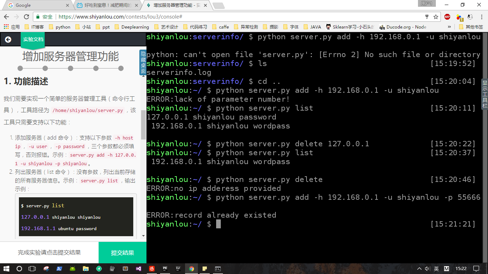

### 实验楼第三期Python 个人解答
1.存储学习记录 solve_studydemo.py  已通过
2.跟踪课程更新 solve_coursedemo.py 已通过
3.修复internal Server Error 修改views.py34行为filter_by(id=id)，而不是filter_by(id==id), 修改todolist.html中第四行为url_for('static')而不是url_for('../static'),修改第九行title去掉todolist.id和+号
4.NoSQL的艺术 solve_getrank.py	已通过
5.增加服务器管理功能 server.py  功能实现了 但是没有通过
 

### 实验楼第九期Python 个人解答
1.修复未正确实现的实验类 lab.py 已通过
